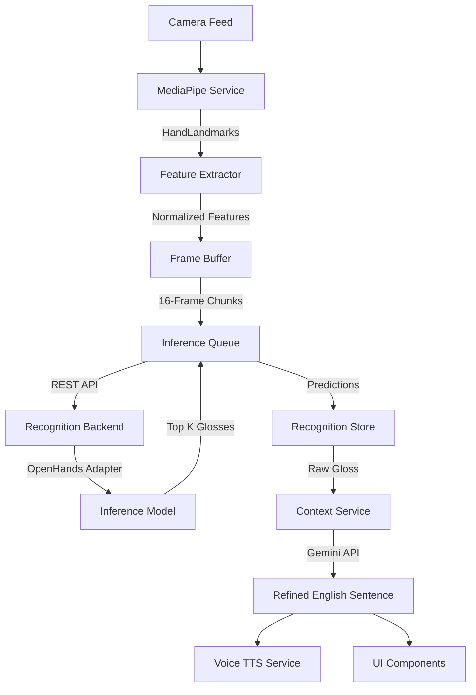

# Kinex Intelligence Integration

This document describes the architectural flow and integration between the Kinex frontend UI, the intelligence pipeline, and the offline OpenHands recognition engine.

## Architectural Overview

Kinex is designed to provide real-time Indian Sign Language (ISL) recognition fully offline, while optionally relying on the cloud (Gemini 1.5 Pro/Flash) strictly for text enrichment, grammar correction, and dictionary definitions.

## Pipeline Components

### 1. The Frontend Pipeline (`src/services/recognition`)
- **MediaPipeService**: Handles camera streaming and runs Google's `HandLandmarker`. Crucially, the WASM binaries and `.task` files are bundled locally to ensure offline compatibility and eliminate CDN dependencies.
- **FeatureExtractor**: Translates complex 3D skeletal landmarks into flattened, normalized 1D arrays optimized for the OpenHands Graph Convolutional Network (GCN).
- **FrameBuffer**: Accumulates feature arrays. Inference is performed on sliding windows of temporal data (default 16 frames).
- **InferenceQueue**: Handles back-pressure. If the backend inference takes longer than the framerate allows, it strategically drops intermediate buffered sequences (latest-frame-wins) to maintain real-time UI responsiveness.
- **RecognitionEngine**: Coordinates the entire flow and triggers Zustand store updates.

### 2. The Backend Engine (`backend/`)
- Built using FastAPI.
- **Vendored OpenHands**: The core `openhands` repository is vendored directly into `backend/vendors/openhands` rather than copied or modified. This means that Kinex can cleanly update OpenHands in the future by simply swapping the vendor folder.
- **ModelService Adapter**: This is the strict boundary layer. No other part of the Kinex backend is allowed to import OpenHands directly. It discovers PyTorch checkpoints dynamically in `backend/models/isl/`.

## Running the Application

### Starting the Backend
1. Ensure Python 3.10+ is installed.
2. Navigate to `backend/`.
3. Install requirements: `pip install -r requirements.txt`.
4. Run the server: `python main.py`.

### Starting the Frontend
1. Ensure Node.js 18+ is installed.
2. Install dependencies: `npm install`.
3. Run the Vite dev server: `npm run dev`.

## Loading a Custom Recognition Model

To enable offline sign language recognition:
1. Obtain a trained ISL checkpoint (`.ckpt`, `.pth`, or `.pt`) generated by the OpenHands framework.
2. Drop the file into `backend/models/isl/`.
3. The Kinex backend will automatically discover and load the model on startup. If no model is found, the system gracefully falls back to a "Recognition Model Not Installed" state in the UI.

## Adding Custom Smart Gloves (Future Hardware)
The architecture abstracts transport and feature extraction. To support a future Kinex Smart Glove:
1. Create a `BluetoothGloveService` that emits raw IMU data.
2. Implement a new extractor inside `FeatureExtractor` to map IMU data to the identical 126-feature tensor shape.
3. The rest of the pipeline (FrameBuffer, Transport, Backend) requires zero changes.
